# brainstrike-typescript-starter


<div align="center">
  
</div>

Starter kit for Node.js + Typescript + React.js + Apollo GraphQL + TypeORM


## Features

- Typescript Node + React + pnpm
- Apollo GraphQL (apollo-client 3.0)
- TypeORM w/ testing connections (Docker-Compose Postgres + GitHub Actions)
- GraphQL Code Generator
- Material UI
- Unit/Integration/E2E tests
- React client with Hooks
- Prettier + ESLint configuration

NOTE: VS Code settings for ESLint+Prettier (consequence of mono repo structure)

"eslint.workingDirectories": [ "./client", "./server" ]

## Prerequisites

Requires Node.js 18.19 or higher, Postgres 11+ required for database. Docker-compose provided for Postgres. Should be easy to adapt examples to other databases... may update database support in future versions.

## Folders

This is setup like a mono-repo with seperate folders for clients and server, each with their own package and config. You could set these up in their own repos, switch to each folder to start the respective packages.

- client - Vite-based React 19 application with Material UI, Apollo Client 3, and GraphQL Code Generator for type-safe hooks plus modern tooling like Vitest.

- server - Apollo Server using [GraphQL Code Generator](https://github.com/dotansimha/graphql-code-generator) for resolvers + types. Using TypeORM for database access, working examples of relay style cursor pagination, unit, integration and e2e tests.

# Recent Updates (as of January 2025)

**BREAKING CHANGE: Migrated from Yarn to pnpm workspaces**

- **Migration to pnpm v9.6.0**: Switched from Yarn to pnpm for better performance, disk space efficiency, and modern workspace features
- **Updated GitHub Actions**: All CI/CD workflows now use pnpm with proper workspace support and PostgreSQL services
- **Modern TypeScript 5.8.2**: Implemented catalog dependencies across workspaces for consistent versioning
- **Enhanced Scripts**: Added comprehensive development scripts including `dev`, `clean`, `typecheck`, and proper workspace filtering
- **Improved Configuration**: Added modern `.npmrc` with optimal pnpm settings for monorepo development
- **Removed Yarn Artifacts**: Cleaned up all Yarn-specific files (.yarnrc.yml, .yarn directories, lock files)

## Getting Started with pnpm

1. Install pnpm globally: `npm install -g pnpm` or use Corepack: `corepack enable pnpm`
2. Install dependencies: `pnpm install`
3. Start development: `pnpm dev` (runs both client and server)
4. Build all packages: `pnpm build`
5. Run tests: `pnpm test`

## Workspace Commands

- `pnpm dev:client` - Start only the React client
- `pnpm dev:server` - Start only the Node.js server
- `pnpm clean` - Clean all node_modules and build artifacts
- `pnpm typecheck` - Run TypeScript type checking across all packages

## API Documentation

This section provides details about the available GraphQL queries and mutations, based on the schema in `server/src/graphql/`.

### Standard Types

*   **`Node` Interface**: Represents an object with an `id`, `created`, and `updated` timestamp. Implemented by `Card` and `Category`.
    *   `id: ID!`
    *   `created: DateTime!`
    *   `updated: DateTime`
*   **`PageInfo` Type**: Provides information about pagination.
    *   `hasNextPage: Boolean!`
    *   `hasPreviousPage: Boolean!`
    *   `startCursor: String`
    *   `endCursor: String`
    *   `totalCount: Int!`
*   **`DirectionEnum` Enum**: Specifies the direction for ordering.
    *   `ASC` (Ascending)
    *   `DESC` (Descending)
*   **Scalar Types**:
    *   `Date`: Represents a date.
    *   `DateTime`: Represents a date and time.
    *   `Time`: Represents a time.

### Queries

#### 1. `cards`

*   **Description**: Retrieves a paginated list of cards. Supports filtering by category and ordering.
*   **Parameters**:
    *   `first` (Int): Returns the first `n` cards.
    *   `last` (Int): Returns the last `n` cards (requires `before`).
    *   `after` (String): Returns cards after the specified cursor.
    *   `before` (String): Returns cards before the specified cursor.
    *   `orderByColumn` (String): Column to order by (e.g., "label", "created"). Defaults to "id" if not specified or invalid.
    *   `orderByDirection` (DirectionEnum): Direction of ordering (`ASC` or `DESC`). Defaults to `ASC`.
    *   `categoryId` (ID): Filters cards by a specific category ID.
*   **Returns**: `CardConnection!`: An object containing a list of cards (`edges`) and pagination information (`pageInfo`).
    *   `CardConnection`:
        *   `pageInfo: PageInfo!`
        *   `edges: [CardEdge!]!`
            *   `CardEdge`:
                *   `cursor: String!`
                *   `node: Card!` (see `Card` type below)
*   **Example**: Get the first 10 cards, ordered by label descending.

```graphql
query GetFirstTenCardsOrdered {
  cards(first: 10, orderByColumn: "label", orderByDirection: DESC) {
    pageInfo {
      hasNextPage
      endCursor
      totalCount
    }
    edges {
      cursor
      node {
        id
        number
        label
        description
        created
        categories {
          id
          name
        }
      }
    }
  }
}
```

#### 2. `card`

*   **Description**: Retrieves a single card by its unique ID.
*   **Parameters**:
    *   `id` (ID!): The unique identifier of the card.
*   **Returns**: `Card!`: The card object if found.
    *   `Card` (implements `Node`):
        *   `id: ID!`
        *   `number: Int`
        *   `label: String`
        *   `description: String`
        *   `created: DateTime!`
        *   `updated: DateTime`
        *   `categories: [Category!]!` (List of categories associated with the card)
*   **Example**:

```graphql
query GetCardById($cardId: ID!) {
  card(id: $cardId) {
    id
    number
    label
    description
    created
    updated
    categories {
      id
      name
    }
  }
}
```

#### 3. `categories`

*   **Description**: Retrieves a list of categories. Supports filtering by card IDs and ordering.
*   **Parameters**:
    *   `cardIds` (String): A comma-separated string of card IDs to filter categories that are associated with these cards.
    *   `orderByColumn` (String): Column to order by (e.g., "name", "created"). Defaults to "id" if not specified or invalid.
    *   `orderByDirection` (DirectionEnum): Direction of ordering (`ASC` or `DESC`). Defaults to `ASC`.
*   **Returns**: `[Category!]!`: A list of category objects.
    *   `Category` (implements `Node`):
        *   `id: ID!`
        *   `name: String`
        *   `created: DateTime!`
        *   `updated: DateTime`
        *   `cards(...)`: A connection to retrieve cards associated with this category (supports same pagination/ordering as the top-level `cards` query).
*   **Example**: Get all categories, ordered by name.

```graphql
query GetAllCategoriesOrdered {
  categories(orderByColumn: "name", orderByDirection: ASC) {
    id
    name
    created
    # Example of fetching cards for each category (first 2)
    cards(first: 2) {
      edges {
        node {
          id
          label
        }
      }
      totalCount
    }
  }
}
```

#### 4. `category`

*   **Description**: Retrieves a single category by its unique ID.
*   **Parameters**:
    *   `id` (ID!): The unique identifier of the category.
*   **Returns**: `Category!`: The category object if found. (See `Category` type definition above).
*   **Example**:

```graphql
query GetCategoryById($categoryId: ID!) {
  category(id: $categoryId) {
    id
    name
    created
    updated
    cards { # Fetch all cards in this category
      edges {
        node {
          id
          label
        }
      }
    }
  }
}
```

#### 5. `node`

*   **Description**: Retrieves any object that implements the `Node` interface by its global ID. This can be a `Card` or a `Category`.
*   **Parameters**:
    *   `id` (ID!): The global unique identifier of the node.
*   **Returns**: `Node!`: The node object if found. You can use inline fragments to get specific fields based on the type.
*   **Example**:

```graphql
query GetNode($nodeId: ID!) {
  node(id: $nodeId) {
    id
    created
    updated
    ... on Card {
      label
      description
      number
      categories {
        id
        name
      }
    }
    ... on Category {
      name
      cards {
        totalCount
      }
    }
  }
}
```

### Mutations

#### Card Mutations

##### 1. `addCard`

*   **Description**: Adds a new card.
*   **Parameters**:
    *   `input` (CardInput!): The details for the new card.
        *   `CardInput`:
            *   `number` (Int)
            *   `label` (String)
            *   `description` (String)
            *   `categoryId` (ID): Optional ID of the category to associate with this card.
*   **Returns**: `CardsUpdatedResponse!`:
    *   `CardsUpdatedResponse`:
        *   `success: Boolean!`
        *   `message: String!`
        *   `card: Card!` (The newly created card)
*   **Example**:

```graphql
mutation AddNewCard($newCard: CardInput!) {
  addCard(input: $newCard) {
    success
    message
    card {
      id
      label
      number
      description
      created
      categories {
        id
        name
      }
    }
  }
}

# Example variables for the above mutation:
# {
#   "newCard": {
#     "label": "New Task Card",
#     "description": "Details about the new task.",
#     "number": 101,
#     "categoryId": "some-category-id" # Optional
#   }
# }
```

##### 2. `updateCard`

*   **Description**: Updates an existing card by its ID.
*   **Parameters**:
    *   `id` (ID!): The ID of the card to update.
    *   `input` (CardInput!): The new details for the card. Fields in `CardInput` are optional for updates.
        *   `CardInput`: (Same as `addCard`)
*   **Returns**: `CardsUpdatedResponse!`: (Same as `addCard`, but `card` is the updated card)
*   **Example**:

```graphql
mutation ModifyCard($cardId: ID!, $updatedData: CardInput!) {
  updateCard(id: $cardId, input: $updatedData) {
    success
    message
    card {
      id
      label
      description
      updated
    }
  }
}

# Example variables for the above mutation:
# {
#   "cardId": "existing-card-id",
#   "updatedData": {
#     "label": "Updated Task Card Label"
#   }
# }
```

##### 3. `removeCard`

*   **Description**: Removes a card by its ID.
*   **Parameters**:
    *   `id` (ID!): The ID of the card to remove.
*   **Returns**: `CardsUpdatedResponse!`: (Same as `addCard`, `card` will be the removed card details)
*   **Example**:

```graphql
mutation DeleteCard($cardId: ID!) {
  removeCard(id: $cardId) {
    success
    message
    card { # Details of the card that was removed
      id
      label
    }
  }
}
```

#### Category Mutations

##### 1. `addCategory`

*   **Description**: Adds a new category.
*   **Parameters**:
    *   `input` (CategoryInput!): The details for the new category.
        *   `CategoryInput`:
            *   `name` (String)
*   **Returns**: `CategoryUpdatedResponse!`:
    *   `CategoryUpdatedResponse`:
        *   `success: Boolean!`
        *   `message: String!`
        *   `category: Category!` (The newly created category)
*   **Example**:

```graphql
mutation AddNewCategory($newCategory: CategoryInput!) {
  addCategory(input: $newCategory) {
    success
    message
    category {
      id
      name
      created
    }
  }
}

# Example variables for the above mutation:
# {
#   "newCategory": {
#     "name": "Project Alpha"
#   }
# }
```

##### 2. `updateCategory`

*   **Description**: Updates an existing category by its ID.
*   **Parameters**:
    *   `id` (ID!): The ID of the category to update.
    *   `input` (CategoryInput!): The new details for the category.
        *   `CategoryInput`: (Same as `addCategory`)
*   **Returns**: `CategoryUpdatedResponse!`: (Same as `addCategory`, but `category` is the updated category)
*   **Example**:

```graphql
mutation ModifyCategory($categoryId: ID!, $updatedData: CategoryInput!) {
  updateCategory(id: $categoryId, input: $updatedData) {
    success
    message
    category {
      id
      name
      updated
    }
  }
}

# Example variables for the above mutation:
# {
#   "categoryId": "existing-category-id",
#   "updatedData": {
#     "name": "Project Beta Features"
#   }
# }
```

##### 3. `removeCategory`

*   **Description**: Removes a category by its ID.
*   **Parameters**:
    *   `id` (ID!): The ID of the category to remove.
*   **Returns**: `CategoryUpdatedResponse!`: (Same as `addCategory`, `category` will be the removed category details)
*   **Example**:

```graphql
mutation DeleteCategory($categoryId: ID!) {
  removeCategory(id: $categoryId) {
    success
    message
    category { # Details of the category that was removed
      id
      name
    }
  }
}
```

## 🏗️ System Architecture

The Brainstrike server follows a modern, layered architecture designed for scalability, maintainability, and type safety:

```mermaid
graph TB
    %% External Layer
    Client["🌐 Client Applications<br/>(React/Next.js)"]
    Studio["🛠️ Apollo Studio<br/>(GraphQL Playground)"]

    %% API Gateway Layer
    subgraph "🚀 API Layer"
        Express["⚡ Express Server<br/>(Port 4000)"]
        CORS["🔒 CORS Middleware<br/>(Security)"]
        Apollo["🚀 Apollo Server<br/>(GraphQL Gateway)"]
    end

    %% Business Logic Layer
    subgraph "🧠 Business Logic"
        Schema["📋 GraphQL Schema<br/>(Type Definitions)"]
        Resolvers["⚙️ GraphQL Resolvers<br/>(Query/Mutation Logic)"]

        subgraph "📊 Data Sources"
            CardAPI["🃏 Card API<br/>(Business Logic)"]
            CategoryAPI["📁 Category API<br/>(Business Logic)"]
        end
    end

    %% Data Access Layer
    subgraph "💾 Data Access Layer"
        TypeORM["🔗 TypeORM<br/>(ORM Framework)"]

        subgraph "📦 Entities"
            CardEntity["🃏 Card Entity"]
            CategoryEntity["📁 Category Entity"]
            UserEntity["👤 User Entity"]
        end

        subgraph "🔄 Database Operations"
            Migrations["📈 Migrations<br/>(Schema Evolution)"]
            Repositories["📚 Repositories<br/>(Data Access)"]
        end
    end

    %% Database Layer
    subgraph "🗄️ Database Layer"
        PostgreSQL["🐘 PostgreSQL<br/>(Primary Database)"]
        TestDB["🧪 Test Database<br/>(brainstrike_test)"]
    end

    %% Development Tools
    subgraph "🛠️ Development & Testing"
        Vitest["⚡ Vitest<br/>(Unit Testing)"]
        Faker["🎭 Faker.js<br/>(Test Data)"]
        Codegen["🔧 GraphQL Codegen<br/>(Type Generation)"]
        ESLint["📏 ESLint + Prettier<br/>(Code Quality)"]
    end

    %% Environment & Config
    subgraph "⚙️ Configuration"
        EnvConfig["🌍 Environment Config<br/>(.env files)"]
        ORMConfig["🔧 ORM Configuration<br/>(Database Settings)"]
    end

    %% Connections
    Client --> Express
    Studio --> Express

    Express --> CORS
    CORS --> Apollo

    Apollo --> Schema
    Apollo --> Resolvers

    Resolvers --> CardAPI
    Resolvers --> CategoryAPI

    CardAPI --> TypeORM
    CategoryAPI --> TypeORM

    TypeORM --> CardEntity
    TypeORM --> CategoryEntity
    TypeORM --> UserEntity

    TypeORM --> Repositories
    TypeORM --> Migrations

    Repositories --> PostgreSQL
    Migrations --> PostgreSQL

    Vitest --> TestDB
    Faker --> TestDB

    EnvConfig --> ORMConfig
    ORMConfig --> TypeORM

    Codegen --> Schema

    %% Styling with black text
    classDef clientLayer fill:#e1f5fe,stroke:#01579b,stroke-width:2px,color:#000000
    classDef apiLayer fill:#f3e5f5,stroke:#4a148c,stroke-width:2px,color:#000000
    classDef businessLayer fill:#e8f5e8,stroke:#1b5e20,stroke-width:2px,color:#000000
    classDef dataLayer fill:#fff3e0,stroke:#e65100,stroke-width:2px,color:#000000
    classDef dbLayer fill:#fce4ec,stroke:#880e4f,stroke-width:2px,color:#000000
    classDef devLayer fill:#f1f8e9,stroke:#33691e,stroke-width:2px,color:#000000
    classDef configLayer fill:#e0f2f1,stroke:#004d40,stroke-width:2px,color:#000000

    class Client,Studio clientLayer
    class Express,CORS,Apollo apiLayer
    class Schema,Resolvers,CardAPI,CategoryAPI businessLayer
    class TypeORM,CardEntity,CategoryEntity,UserEntity,Migrations,Repositories dataLayer
    class PostgreSQL,TestDB dbLayer
    class Vitest,Faker,Codegen,ESLint devLayer
    class EnvConfig,ORMConfig configLayer
```



### Architecture Highlights

- **🌐 Client Layer**: React/Next.js applications and Apollo Studio for development
- **🚀 API Layer**: Express.js with Apollo Server providing a robust GraphQL gateway
- **🧠 Business Logic**: Clean separation with dedicated data source APIs and resolvers
- **💾 Data Access**: TypeORM with entity models and repository patterns
- **🗄️ Database**: PostgreSQL with separate test database for development
- **🛠️ Development**: Comprehensive testing and code generation tools
- **⚙️ Configuration**: Environment-based configuration management

This architecture ensures **type safety**, **scalability**, and **maintainability** while following modern best practices for GraphQL APIs.
