# brainstrike-typescript-starter

  

Starter kit for Node.js + Typescript + React.js + Apollo GraphQL + TypeORM

## Features

- Typescript Node + React + pnpm
- Apollo GraphQL (apollo-client 3.0)
- TypeORM w/ testing connections (Docker-Compose Postgres + GitHub Actions)
- GraphQL Code Generator
- Material UI
- Unit/Integration/E2E tests
- React client with Hooks
- Prettier + ESLint configuration

NOTE: VS Code settings for ESLint+Prettier (consequence of mono repo structure)

"eslint.workingDirectories": [ "./client", "./server" ]

## Prerequisites

Tested with Node 12+, Postgres 11+ required for database. Docker-compose provided for Postgres. Should be easy to adapt examples to other databases... may update database support in future versions.

## Folders

This is setup like a mono-repo with seperate folders for clients and server, each with their own package and config. You could set these up in their own repos, switch to each folder to start the respective packages.

- client = Material UI based React TypeScript (create-react-app non ejected), using [GraphQL Code Generator](https://github.com/dotansimha/graphql-code-generator) for hooks + TypeScript Types. Apollo Client 3.0.

- server - Apollo Server using [GraphQL Code Generator](https://github.com/dotansimha/graphql-code-generator) for resolvers + types. Using TypeORM for database access, working examples of relay style cursor pagination, unit, integration and e2e tests.

# Recent Updates (as of January 2025)

**BREAKING CHANGE: Migrated from Yarn to pnpm workspaces**

- **Migration to pnpm v9.6.0**: Switched from Yarn to pnpm for better performance, disk space efficiency, and modern workspace features
- **Updated GitHub Actions**: All CI/CD workflows now use pnpm with proper workspace support and PostgreSQL services
- **Modern TypeScript 5.8.2**: Implemented catalog dependencies across workspaces for consistent versioning
- **Enhanced Scripts**: Added comprehensive development scripts including `dev`, `clean`, `typecheck`, and proper workspace filtering
- **Improved Configuration**: Added modern `.npmrc` with optimal pnpm settings for monorepo development
- **Removed Yarn Artifacts**: Cleaned up all Yarn-specific files (.yarnrc.yml, .yarn directories, lock files)

## Getting Started with pnpm

1. Install pnpm globally: `npm install -g pnpm` or use Corepack: `corepack enable pnpm`
2. Install dependencies: `pnpm install`
3. Start development: `pnpm dev` (runs both client and server)
4. Build all packages: `pnpm build`
5. Run tests: `pnpm test`

## Workspace Commands

- `pnpm dev:client` - Start only the React client
- `pnpm dev:server` - Start only the Node.js server
- `pnpm clean` - Clean all node_modules and build artifacts
- `pnpm typecheck` - Run TypeScript type checking across all packages

## 🏗️ System Architecture

The Brainstrike server follows a modern, layered architecture designed for scalability, maintainability, and type safety:

```mermaid
graph TB
    %% External Layer
    Client["🌐 Client Applications<br/>(React/Next.js)"]
    Studio["🛠️ Apollo Studio<br/>(GraphQL Playground)"]

    %% API Gateway Layer
    subgraph "🚀 API Layer"
        Express["⚡ Express Server<br/>(Port 4000)"]
        CORS["🔒 CORS Middleware<br/>(Security)"]
        Apollo["🚀 Apollo Server<br/>(GraphQL Gateway)"]
    end

    %% Business Logic Layer
    subgraph "🧠 Business Logic"
        Schema["📋 GraphQL Schema<br/>(Type Definitions)"]
        Resolvers["⚙️ GraphQL Resolvers<br/>(Query/Mutation Logic)"]

        subgraph "📊 Data Sources"
            CardAPI["🃏 Card API<br/>(Business Logic)"]
            CategoryAPI["📁 Category API<br/>(Business Logic)"]
        end
    end

    %% Data Access Layer
    subgraph "💾 Data Access Layer"
        TypeORM["🔗 TypeORM<br/>(ORM Framework)"]

        subgraph "📦 Entities"
            CardEntity["🃏 Card Entity"]
            CategoryEntity["📁 Category Entity"]
            UserEntity["👤 User Entity"]
        end

        subgraph "🔄 Database Operations"
            Migrations["📈 Migrations<br/>(Schema Evolution)"]
            Repositories["📚 Repositories<br/>(Data Access)"]
        end
    end

    %% Database Layer
    subgraph "🗄️ Database Layer"
        PostgreSQL["🐘 PostgreSQL<br/>(Primary Database)"]
        TestDB["🧪 Test Database<br/>(brainstrike_test)"]
    end

    %% Development Tools
    subgraph "🛠️ Development & Testing"
        Vitest["⚡ Vitest<br/>(Unit Testing)"]
        Faker["🎭 Faker.js<br/>(Test Data)"]
        Codegen["🔧 GraphQL Codegen<br/>(Type Generation)"]
        ESLint["📏 ESLint + Prettier<br/>(Code Quality)"]
    end

    %% Environment & Config
    subgraph "⚙️ Configuration"
        EnvConfig["🌍 Environment Config<br/>(.env files)"]
        ORMConfig["🔧 ORM Configuration<br/>(Database Settings)"]
    end

    %% Connections
    Client --> Express
    Studio --> Express

    Express --> CORS
    CORS --> Apollo

    Apollo --> Schema
    Apollo --> Resolvers

    Resolvers --> CardAPI
    Resolvers --> CategoryAPI

    CardAPI --> TypeORM
    CategoryAPI --> TypeORM

    TypeORM --> CardEntity
    TypeORM --> CategoryEntity
    TypeORM --> UserEntity

    TypeORM --> Repositories
    TypeORM --> Migrations

    Repositories --> PostgreSQL
    Migrations --> PostgreSQL

    Vitest --> TestDB
    Faker --> TestDB

    EnvConfig --> ORMConfig
    ORMConfig --> TypeORM

    Codegen --> Schema

    %% Styling with black text
    classDef clientLayer fill:#e1f5fe,stroke:#01579b,stroke-width:2px,color:#000000
    classDef apiLayer fill:#f3e5f5,stroke:#4a148c,stroke-width:2px,color:#000000
    classDef businessLayer fill:#e8f5e8,stroke:#1b5e20,stroke-width:2px,color:#000000
    classDef dataLayer fill:#fff3e0,stroke:#e65100,stroke-width:2px,color:#000000
    classDef dbLayer fill:#fce4ec,stroke:#880e4f,stroke-width:2px,color:#000000
    classDef devLayer fill:#f1f8e9,stroke:#33691e,stroke-width:2px,color:#000000
    classDef configLayer fill:#e0f2f1,stroke:#004d40,stroke-width:2px,color:#000000

    class Client,Studio clientLayer
    class Express,CORS,Apollo apiLayer
    class Schema,Resolvers,CardAPI,CategoryAPI businessLayer
    class TypeORM,CardEntity,CategoryEntity,UserEntity,Migrations,Repositories dataLayer
    class PostgreSQL,TestDB dbLayer
    class Vitest,Faker,Codegen,ESLint devLayer
    class EnvConfig,ORMConfig configLayer
```

### Architecture Highlights

- **🌐 Client Layer**: React/Next.js applications and Apollo Studio for development
- **🚀 API Layer**: Express.js with Apollo Server providing a robust GraphQL gateway
- **🧠 Business Logic**: Clean separation with dedicated data source APIs and resolvers
- **💾 Data Access**: TypeORM with entity models and repository patterns
- **🗄️ Database**: PostgreSQL with separate test database for development
- **🛠️ Development**: Comprehensive testing and code generation tools
- **⚙️ Configuration**: Environment-based configuration management

This architecture ensures **type safety**, **scalability**, and **maintainability** while following modern best practices for GraphQL APIs.
